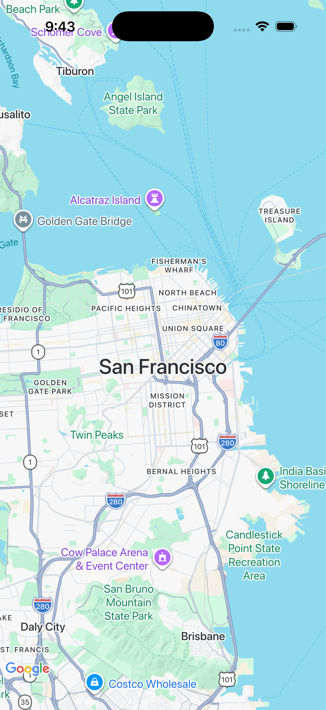
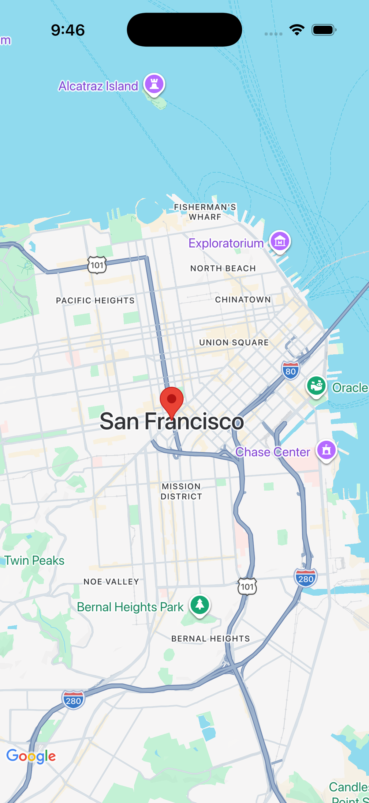
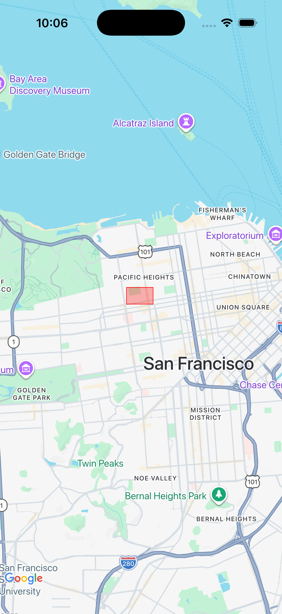
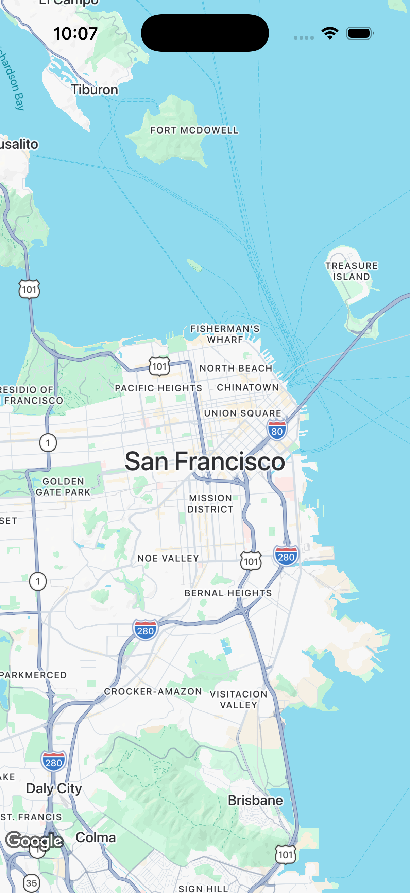

# @balloman/expo-google-maps

A native Expo module providing Google Maps integration for iOS and Android applications. On iOS especially, I find that this module is significantly more performant than react-native-maps.


## Features

- Native Google Maps rendering on iOS and Android
- Camera control with animation support
- Custom markers with icon support
- Polygon overlays
- User location display
- Custom map styling via JSON

## Requirements

- iOS 16.0+ / Android API 21+
- Expo SDK 52+
- React Native 0.76+
- Google Maps API key
- New Architecture

## Installation

```bash
npx expo install @balloman/expo-google-maps
```

## Configuration

### iOS Setup

1. Obtain a Google Maps API key from the [Google Cloud Console](https://console.cloud.google.com/)
2. Enable the Maps SDK for iOS
3. Add the following to your app initialization:

```typescript
import { setApiKey } from '@balloman/expo-google-maps';

// Call before rendering any maps
setApiKey('YOUR_IOS_API_KEY');
```

### Android Setup

1. Obtain a Google Maps API key from the [Google Cloud Console](https://console.cloud.google.com/)
2. Enable the Maps SDK for Android
3. Configure the plugin in your `app.json` or `app.config.js`:

```json
{
  "expo": {
    "plugins": [
      [
        "@balloman/expo-google-maps",
        {
          "androidApiKey": "YOUR_ANDROID_API_KEY"
        }
      ]
    ]
  }
}
```

## Usage

### Basic Map

**Important:** The MapView must be positioned absolutely within its parent container. Using `flex: 1` or relative positioning will not work correctly.



```typescript
import { MapView } from '@balloman/expo-google-maps';

function App() {
  return (
    <View style={{ flex: 1 }}>
      <MapView
        camera={{
          center: { latitude: 37.7749, longitude: -122.4194 },
          zoom: 12,
        }}
        style={{ position: 'absolute', top: 0, left: 0, right: 0, bottom: 0 }}
      />
    </View>
  );
}
```

### Map with Markers



```typescript
import { MapView, MarkerView } from '@balloman/expo-google-maps';

function App() {
  return (
    <View style={{ flex: 1 }}>
      <MapView
        camera={{
          center: { latitude: 37.7749, longitude: -122.4194 },
          zoom: 12,
        }}
        style={{ position: 'absolute', top: 0, left: 0, right: 0, bottom: 0 }}
      >
        <MarkerView
          marker={{
            position: { latitude: 37.7749, longitude: -122.4194 },
            title: 'San Francisco',
            key: 'sf-marker',
          }}
          onMarkerPress={() => console.log('Marker pressed')}
        />
      </MapView>
    </View>
  );
}
```

### Camera Animation


https://github.com/user-attachments/assets/340c9629-7bc3-4a1c-a9b4-62cbecde5de5


```typescript
import { useRef } from 'react';
import { MapView, type MapFunctions } from '@balloman/expo-google-maps';

function App() {
  const mapRef = useRef<MapFunctions>(null);

  const animateToLocation = async () => {
    await mapRef.current?.animateCamera(
      {
        center: { latitude: 40.7128, longitude: -74.0060 },
        zoom: 14,
        bearing: 45,
        viewingAngle: 30,
      },
      {
        animationDuration: 2,
        animationFunction: 'easeInEaseOut',
      }
    );
  };

  return (
		<View
			style={{
				flex: 1,
				justifyContent: 'center',
				alignItems: 'center',
			}}
		>
			<MapView
				mapRef={mapRef}
				camera={{
					center: { latitude: 37.7749, longitude: -122.4194 },
					zoom: 12,
				}}
				style={{ position: 'absolute', top: 0, left: 0, right: 0, bottom: 0 }}
			/>
			<View style={{ backgroundColor: 'brown', top: '25%' }}>
				<Button
					title="Click Me"
					color="white"
					onPress={() => animateToLocation()}
				></Button>
			</View>
		</View>
  );
}
```

### Polygons



```typescript
import { MapView } from '@balloman/expo-google-maps';

function App() {
  return (
    <View style={{ flex: 1 }}>
      <MapView
        camera={{
          center: { latitude: 37.7749, longitude: -122.4194 },
          zoom: 12,
        }}
        polygons={[
          {
            key: 'polygon-1',
            coordinates: [
							{ latitude: 37.78825, longitude: -122.4324 },
							{ latitude: 37.78825, longitude: -122.44 },
							{ latitude: 37.792, longitude: -122.44 },
							{ latitude: 37.792, longitude: -122.4324 },
            ],
            fillColor: 'rgba(255, 0, 0, 0.3)',
            strokeColor: 'red',
          },
        ]}
        style={{ position: 'absolute', top: 0, left: 0, right: 0, bottom: 0 }}
      />
    </View>
  );
}
```

### Custom Map Style



```typescript
import { MapView } from '@balloman/expo-google-maps';

const mapStyle = JSON.stringify([
  {
    featureType: 'poi',
    elementType: 'labels',
    stylers: [{ visibility: 'off' }],
  },
]);

function App() {
  return (
    <View style={{ flex: 1 }}>
      <MapView
        camera={{
          center: { latitude: 37.7749, longitude: -122.4194 },
          zoom: 12,
        }}
        styleJson={mapStyle}
        style={{ position: 'absolute', top: 0, left: 0, right: 0, bottom: 0 }}
      />
    </View>
  );
}
```

## API Reference

### Components

#### MapView

The main map component.

**Props:**

| Prop | Type | Required | Description |
|------|------|----------|-------------|
| camera | Camera | Yes | The camera position configuration |
| polygons | Polygon[] | No | Array of polygons to display |
| styleJson | string | No | JSON string for custom map styling |
| showUserLocation | boolean | No | Enable user location display (default: false) |
| mapRef | React.Ref<MapFunctions> | No | Ref to access imperative methods (use `mapRef` not `ref`) |
| onMapIdle | (event: { cameraPosition: Camera }) => void | No | Called when map stops moving |
| onDidChange | (event: { cameraPosition: Camera }) => void | No | Called during camera changes |

**Imperative Methods (via mapRef):**

- `animateCamera(camera: Camera, options?: AnimationOptions): Promise<void>`
- `fitToBounds(options: FitToBoundsOptions, animationOptions?: AnimationOptions): Promise<void>`

#### MarkerView

A marker component to be used as a child of MapView.

**Props:**

| Prop | Type | Required | Description |
|------|------|----------|-------------|
| marker | Marker | Yes | Marker configuration |
| onMarkerPress | () => void | No | Callback when marker is pressed |
| tracksViewChanges | boolean | No | Android only: redraw icon on every render (default: false) |
| children | React.ReactElement | No | Custom icon content |

### Types

#### Camera

```typescript
type Camera = {
  center: Coordinate;
  zoom: number;
  bearing?: number;
  viewingAngle?: number;
};
```

#### Coordinate

```typescript
type Coordinate = {
  latitude: number;
  longitude: number;
};
```

#### Marker

```typescript
type Marker = {
  position: Coordinate;
  title?: string;
  key: string;
};
```

#### Polygon

```typescript
type Polygon = {
  key: string;
  coordinates: Coordinate[];
  strokeColor: string;
  fillColor?: string;
};
```

#### AnimationOptions

```typescript
type AnimationOptions = {
  animationDuration?: number;
  animationFunction?: 'easeIn' | 'easeOut' | 'easeInEaseOut' | 'linear' | 'default';
};
```

#### FitToBoundsOptions

```typescript
type FitToBoundsOptions = {
  topRight: Coordinate;
  bottomLeft: Coordinate;
  insets?: {
    top?: number;
    left?: number;
    bottom?: number;
    right?: number;
  };
};
```

## Platform-Specific Notes

### iOS

- Minimum deployment target: iOS 16.0
- Requires Google Maps SDK for iOS
- Camera animations support custom timing functions

### Android

- Minimum SDK: API 21 (Android 5.0)
- API key configured via plugin
- `tracksViewChanges` prop available for marker icons

## Troubleshooting

### Map not displaying on iOS

Ensure you have called `setApiKey()` before rendering any MapView components.

### Build errors on iOS

Make sure your iOS deployment target is set to 16.0 or higher in your Podfile.

## License

MIT

## Contributing

Contributions are welcome. Please open an issue or pull request on GitHub.

## Support

For issues and feature requests, please use the issue tracker in the Github.
